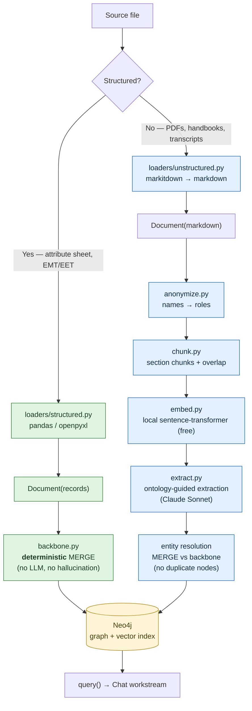
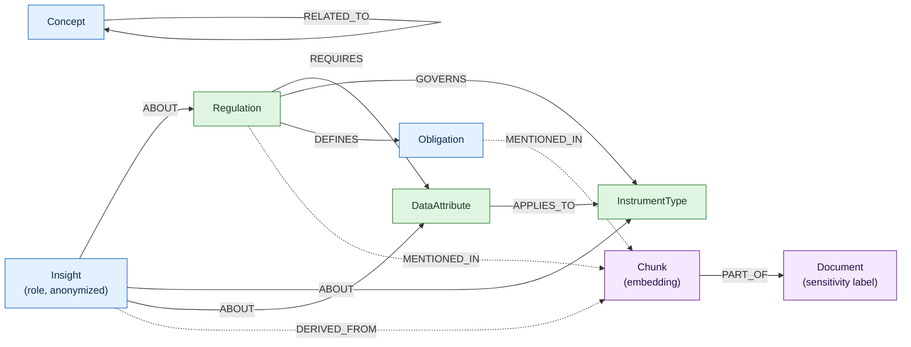
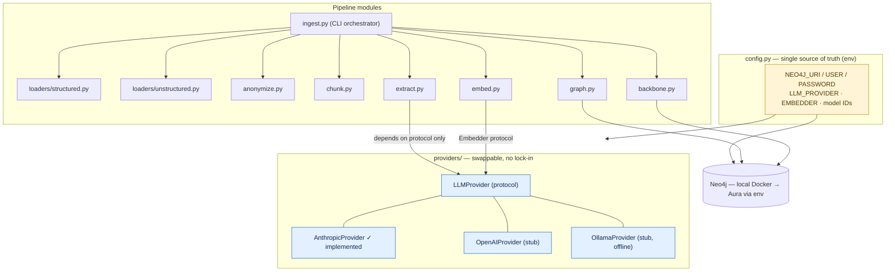

# Company Brain — Architecture Visualisation

> **Living document.** We update these diagrams as the architecture evolves, to keep the team aligned.
> Renders on GitHub and in any Mermaid-aware markdown preview (VS Code: "Markdown Preview Mermaid Support").
> Scope: **ingestion + knowledge graph** workstream. See the full design in
> [`superpowers/specs/2026-05-29-ingestion-knowledge-graph-design.md`](superpowers/specs/2026-05-29-ingestion-knowledge-graph-design.md).

**Version:** v0.1 — initial (2026-05-29)

---

## 1. Big picture — three workstreams

---

## 2. Ingestion pipeline — data flow

**Legend:** 🟢 deterministic / no-cost · 🔵 LLM or embedding path · 🟡 store.

---

## 3. Knowledge graph ontology

- 🟢 **Backbone** nodes/edges: built deterministically from the structured files — authoritative, cannot hallucinate.
- 🔵 **Reasoning** layer: extracted by Claude; `Insight` carries anonymized tacit knowledge.
- 🟣 **Provenance**: solid backbone/reasoning edges vs **dotted** provenance edges (`MENTIONED_IN` / `DERIVED_FROM` / `PART_OF`) — every claim traces to a `Chunk` → `Document` with a sensitivity label.

---

## 4. Module map & provider abstraction

**Swap points (env-only, no code change):** graph store (local Docker ↔ Aura), LLM provider (Anthropic ↔ OpenAI ↔ Ollama), embedder (local ↔ hosted).

---

## Changelog

| Version | Date | Change |
|---|---|---|
| v0.1 | 2026-05-29 | Initial architecture: 3-workstream view, ingestion flow, ontology, module/provider map |
