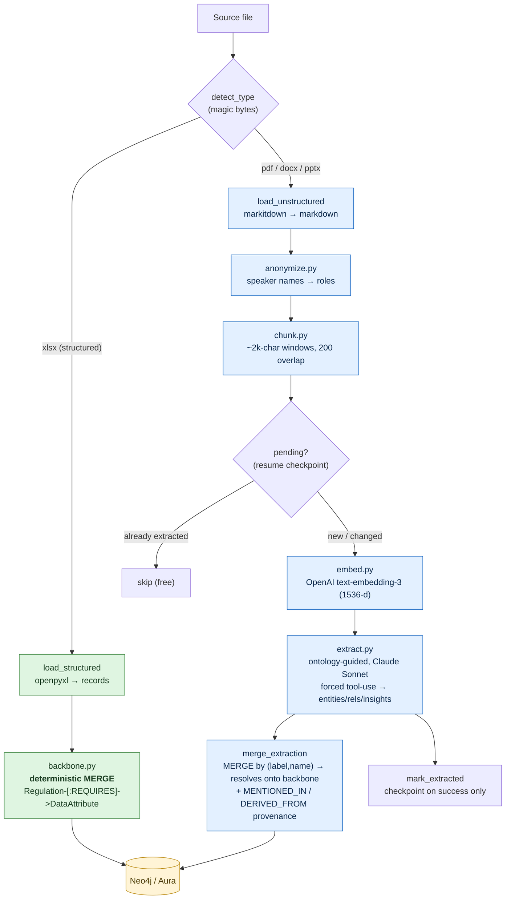
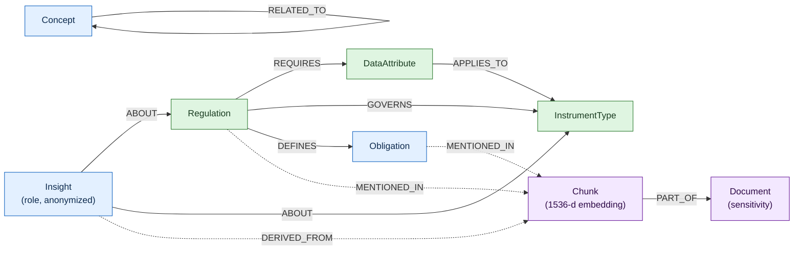
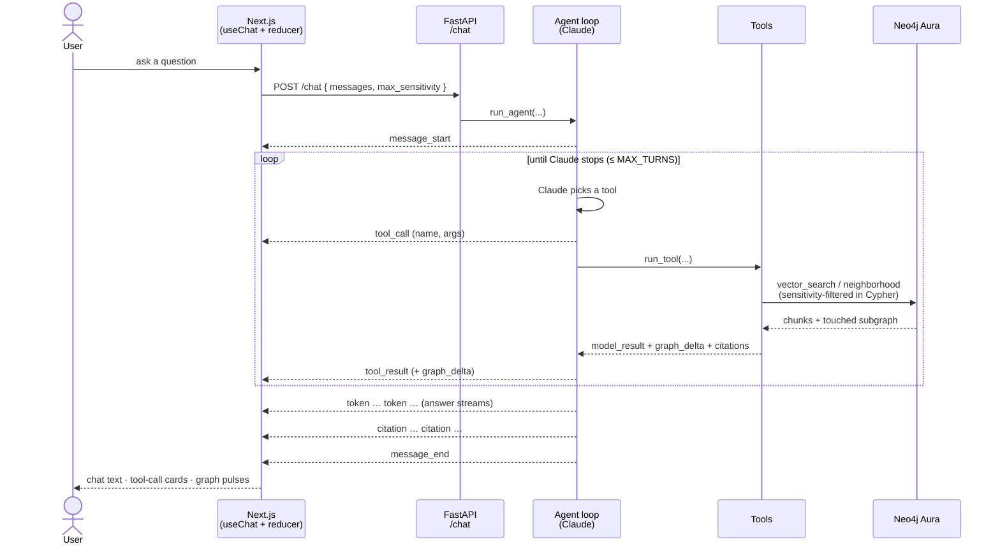
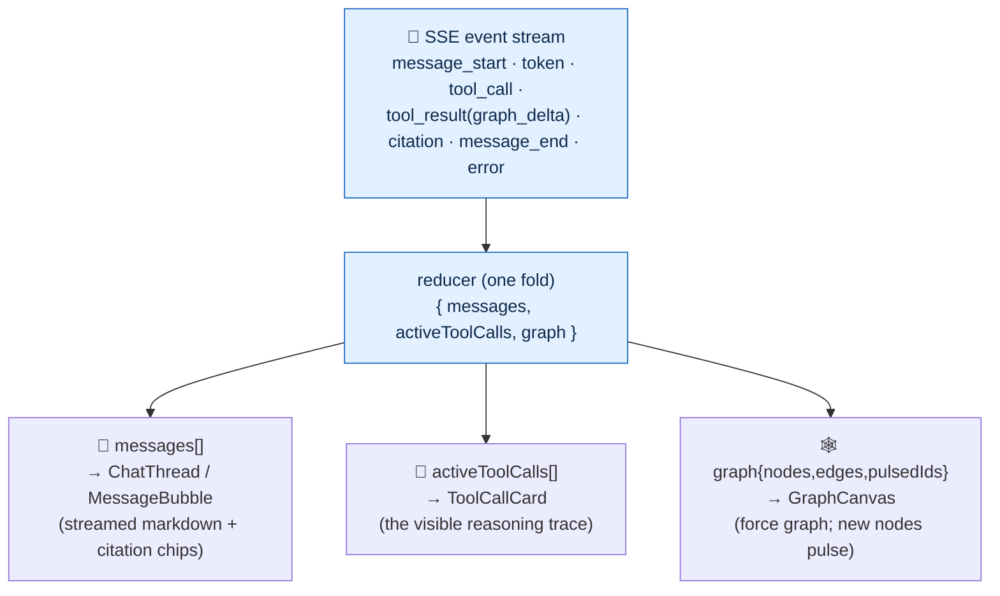
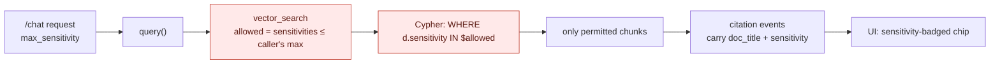
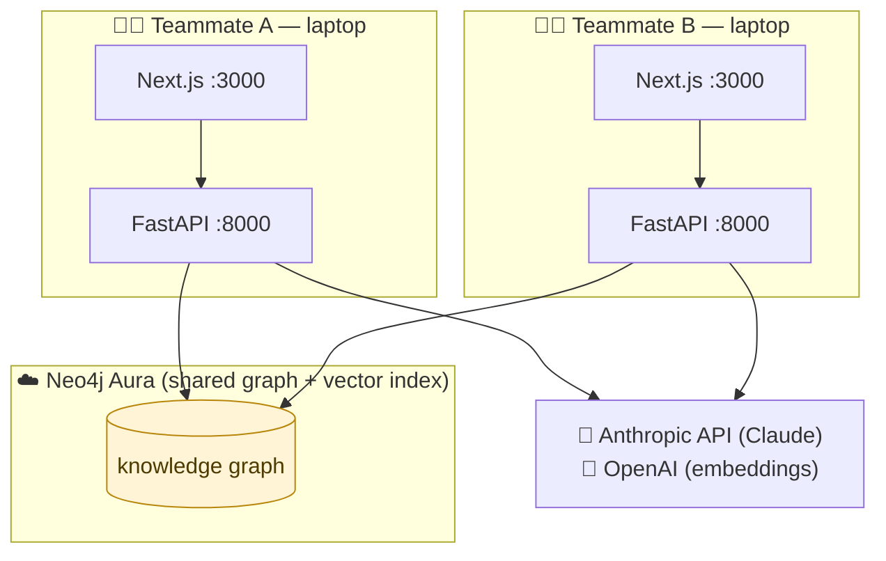
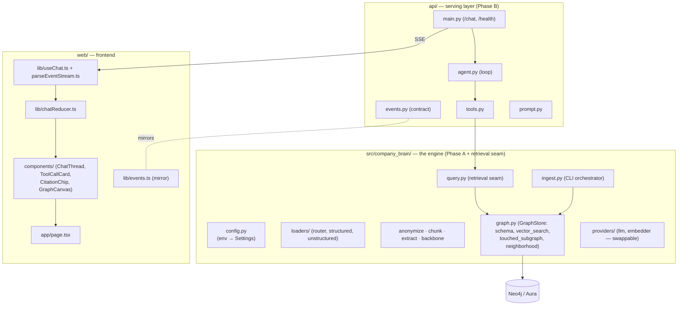

# Company Brain — Architecture & Illustration

> **The SIX "Build the Company Brain" system, end to end.** Captures tacit + explicit
> expert knowledge from a regulatory corpus into a knowledge graph, and makes it
> reusable through a traceable, access-controlled AI chat.
>
> Diagrams are [Mermaid](https://mermaid.js.org/) — they render on GitHub and in any
> Mermaid-aware Markdown preview. Living document; update as the system evolves.

---

## 1. The big idea (one minute)

The system has **two phases** and a **three-layer knowledge graph**.

- **Phase A — Ingestion (offline).** Raw files → a knowledge graph in Neo4j. Run from the CLI.
- **Phase B — Serving (online).** A question → a Claude agent does graph-grounded retrieval → a streamed, cited answer + a live graph view. FastAPI + Next.js.

The graph is deliberately layered: a **deterministic backbone** that cannot hallucinate, an
**LLM reasoning layer** that captures tacit expertise, and a **provenance layer** so every claim
traces home to a source document with a sensitivity label.

```mermaid
flowchart LR
    subgraph SRC["📁 Source corpus"]
      PDF["PDFs / DOCX<br/>regs + SME transcripts"]
      XLS["Attribute xlsx<br/>(the spine)"]
    end

    subgraph INGEST["⚙️ Ingestion pipeline — offline, CLI"]
      direction TB
      LOAD["load + markitdown"] --> ANON["anonymize<br/>names → roles"] --> CHUNK["chunk"] --> EMB["embed<br/>OpenAI 1536-d"] --> EXT["extract<br/>Claude Sonnet"]
      BB["backbone MERGE<br/><b>no LLM</b>"]
    end

    GRAPH[("🕸️ Neo4j Aura<br/>graph + vector index")]

    subgraph API["🚀 FastAPI — api/"]
      AGENT["agent loop<br/>Claude tool-use"]
      CHAT["POST /chat (SSE)"]
    end

    subgraph WEB["💬 Next.js — web/"]
      RED["reducer"]
      UI["chat · tool cards · live graph"]
    end

    PDF --> LOAD
    XLS --> BB
    EXT --> GRAPH
    BB --> GRAPH
    GRAPH --> AGENT --> CHAT -->|"SSE events"| RED --> UI
    UI -->|"POST question"| CHAT

    classDef store fill:#fff4d6,stroke:#b8860b,color:#4d3b00;
    classDef llm fill:#e3f0ff,stroke:#1565c0,color:#0d2a4d;
    classDef det fill:#dff5e1,stroke:#2e7d32,color:#1b3d22;
    class GRAPH store;
    class EMB,EXT,AGENT llm;
    class BB det;
```



---

## 2. Ingestion pipeline (Phase A)

Each file is classified by **magic bytes** (so a mislabeled `.pdf` that's really an xlsx still
routes correctly), tagged with a `domain` and a `sensitivity` label from its filename, then
routed down one of two paths.



**Properties that fall out of this design**

| Property | How |
|---|---|
| Backbone can't hallucinate | Built deterministically from the spreadsheet — no LLM |
| Idempotent | Everything is `MERGE`d; re-running never duplicates |
| Resumable | Per-chunk checkpoint (`extracted` flag set only on success) → re-runs skip done work, no re-embed/re-extract cost |
| Privacy-safe | Names → roles **before** anything is stored |
| Cost-isolated | One malformed chunk is logged and retried next run, never discards the document |

---

## 3. The knowledge graph (the brain)

Neo4j does **double duty**: it's the graph *and* the vector store (a native cosine index over
chunk embeddings). Three layers:



- 🟢 **Backbone** — authoritative `Regulation → REQUIRES → DataAttribute` from the spreadsheet.
- 🔵 **Reasoning** — LLM-extracted entities, relationships, and `Insight` nodes (the tacit
  "it depends…" expertise from SME transcripts). Entities `MERGE` onto the backbone, so the two
  layers share nodes instead of duplicating.
- 🟣 **Provenance** — dotted edges (`MENTIONED_IN` / `DERIVED_FROM` / `PART_OF`): every claim
  traces to a `Chunk` → `Document` carrying a sensitivity label. This is what makes answers citable.

Node ID convention (used verbatim by the frontend graph): `"<Label>:<name>"`, `"Chunk:<id>"`,
`"Document:<doc_id>"`.

---

## 4. Serving: anatomy of a chat turn (Phase B)

The frontend POSTs the conversation; the backend runs a **Claude tool-use loop** and streams a
single sequence of **typed events** over SSE. The agent decides which tools to call — genuine
multi-step reasoning, not a single retrieve-then-answer pass.



**Tools** (thin wrappers over the existing engine):

| Tool | Does | Side-channel to UI |
|---|---|---|
| `search_knowledge` | semantic search (vector) + 1-hop graph expand | `graph_delta` of touched chunks/entities + `citations` |
| `expand_graph` | 1-hop neighborhood around an entity | `graph_delta` of the neighborhood |
| `lookup_backbone` | authoritative `REQUIRES` facts only | `graph_delta` (hallucination-proof path) |

---

## 5. The event contract — one stream, three views (the keystone)

Every feature is a **subscriber to one typed event stream**. The frontend runs a single pure
reducer that folds events into state; three components render slices of it. Get this contract
right and chat, tool cards, and the live graph stop being three integrations — they're three
views of one fold.



The contract is defined once in `api/events.py` (Pydantic) and mirrored in `web/lib/events.ts`
(TypeScript) — the **only** coupling between front and back. (Wire note: `sse-starlette` emits
CRLF frame separators; the parser normalizes `\r\n` → `\n`.)

**Forward-compatible:** v2 voice/avatar adds `transcript` / `audio` event types to the same
union — the reducer ignores unknown types today, routes them tomorrow. No protocol break.

---

## 6. Trust & governance (the graded criteria, enforced in code)



- **Access control is enforced server-side, in the retrieval Cypher** — the model never sees
  content above the caller's level. `Confidential` is excluded at `C2 Internal` by default.
  Guarded by a test against the real `vector_search`, not a mock.
- **Provenance rides the protocol** — `citation` events carry `sensitivity` all the way to a
  visible badge. Nothing is asserted without a traceable source chunk.
- **Reasoning-layer guard** — the system prompt forbids answering beyond retrieved content.

---

## 7. Deployment topology (shared via Aura)

The knowledge graph lives in **Neo4j Aura** (cloud). Each teammate runs their own backend +
frontend locally, all pointing at the same Aura instance — the graph *is* the shared resource.
Switching from local Docker → Aura is **env-only** (`NEO4J_*`), no code change.



Migration was a **non-destructive Cypher copy** (`scripts/migrate_to_aura.py`) that preserved
embeddings + the vector index and verified node/edge counts. Future ingests point at Aura and
`MERGE` additively (cumulative — no re-migration).

---

## 8. Repo / module map



---

## 9. Tech stack

| Layer | Choice |
|---|---|
| Graph + vectors | Neo4j 5.x (Aura cloud / local Docker) — one store, both modes |
| LLM (reasoning + extraction) | Anthropic Claude Sonnet (tool-use) — swappable via `providers/` |
| Embeddings | OpenAI `text-embedding-3-small` (1536-d) — swappable (local sentence-transformers also supported) |
| Backend | FastAPI + `sse-starlette` (SSE), Pydantic v2 |
| Frontend | Next.js (App Router) + TypeScript + Tailwind + `react-force-graph-2d` |
| Doc conversion | markitdown |
| Tests | pytest (backend) · Vitest + Playwright (frontend) |

---

## 10. What's deferred (v2)

- **Voice / animated avatar** ("talk to it", ChatGPT-voice style) — the event contract is already
  open for additive `transcript` / `audio` events.
- **In-product ingestion-status visualization** — a `/ingest/status` endpoint + a live progress
  panel (see `planning/TODO.md`).
- Streaming token-level model output (currently chunked from full turns behind the same event
  interface); async, non-blocking model calls for multi-user scale.
```
